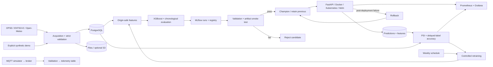

# GridPulse AI

**Energy forecasting and an executable MLOps lifecycle — personal portfolio project.**

Hourly German electricity demand forecasting, with a fixed next-24-hours horizon: acquisition,
validation, features, XGBoost, MLflow, FastAPI, PostgreSQL, MQTT, Docker, Kubernetes/Helm,
Prometheus/Grafana, drift/performance monitoring, controlled retraining and rollback.
This is not employment work, a customer system, or a live energy-operator deployment.

Demand forecasts support capacity planning and supply balancing. This project demonstrates the
engineering lifecycle behind that problem at a deliberate scope: one market and national MW load.
It does not implement trading, dispatch, grid control, price forecasting or renewable forecasting.

[Verification record](docs/verification.md) distinguishes observed local results from unverified
external integrations. [Operations runbook](docs/operations.md) contains detailed setup and recovery.

## Quick start

Install Python 3.12 and [uv](https://docs.astral.sh/uv/), then:

```sh
uv sync --frozen
uv run gridpulse demo
uv run uvicorn apps.api.main:app --host 127.0.0.1 --port 8000
```

In another terminal, run `uv run gridpulse smoke`. This trains a **real XGBoost model on explicitly
synthetic data**, creates an actual MLflow run/registered version, validates it and serves computed
predictions. SQLite and local artifacts make this native demo credential-free.

For the full PostgreSQL, MLflow, MQTT and monitoring stack:

```sh
uv run python scripts/init_env.py
docker compose up -d --build
docker compose exec -T api gridpulse smoke --url http://localhost:8000
```

The setup script generates local passwords and refuses to overwrite `.env`. All published ports
bind to loopback. Stop with `docker compose down`; named volumes remain. Bootstrap trains only when
there is no champion, as a runtime job. Docker builds never train a release model.

| Interface | Local address |
| --- | --- |
| API / OpenAPI | [localhost:8000/docs](http://localhost:8000/docs) |
| MLflow tracking/registry | [localhost:5000](http://localhost:5000) |
| Prometheus | [localhost:9090](http://localhost:9090) |
| Grafana | [localhost:3000](http://localhost:3000), admin / password in ignored `.env` |

## Architecture



[Full diagram](docs/architecture.mmd) · [Architecture decisions](docs/architecture.md)

One modular Python package owns domain behavior. API, training jobs and MQTT ingestion reuse it.
PostgreSQL stores structured operational data; MLflow manages experiments, registry and artifacts.
There is no Kafka, Spark, Airflow, feature-store service or unnecessary microservice layer.

## Data and features

The default synthetic dataset is deterministic and never represented as measured observations.
The real public-data path was also executed:

```sh
uv run gridpulse data --source opsd --start 2019-01-01 --end 2019-03-31
```

Set `GRIDPULSE_DATA_SOURCE=opsd`, `GRIDPULSE_MODEL_NAME=gridpulse-de-demand-opsd` and
`GRIDPULSE_ENV=demo`, then run `uv run gridpulse train --promote`. Use a separate model name to retain
the synthetic champion. ENTSO-E requires `ENTSOE_API_KEY`; its modern DE_LU bidding zone differs
slightly from OPSD Germany. Weather is an explicitly limited Berlin proxy from Open-Meteo.

The canonical schema contains UTC hourly `timestamp`, positive `demand` (MW), `temperature` and
`apparent_temperature` (°C), `wind` (km/h), `cloud_cover` (%) and `solar_radiation` (W/m²).
Optional `generation` and `price` columns are future extension points. Validation rejects missing
or extra columns, duplicate/unordered timestamps, gaps, missing/non-finite values and incomplete
upstream windows. Live-mode real-source inference/retraining enforces freshness; retrospective
demo mode explicitly permits historical windows. No silent synthetic fallback or imputation occurs.

`features.at_origin` is shared by training and serving. It uses 168 observed hours: lags
1h/2h/24h/48h/7d; mean/min/max/std over 3h/24h/7d; origin weather; target calendar (Berlin local time,
German national holidays); horizon; quality indicators. Missing/stale indicators are zero for
accepted inputs because incomplete inputs are rejected. [Schema, storage/indexes and lifecycle](docs/data.md)

## ML methodology and measured results

One direct XGBoost model handles 24 horizons using observed-origin features and the target calendar.
It never reads future demand or realized future weather. Non-overlapping daily target blocks are
split chronologically 70%/15%/15%. Two tree depths are compared on validation, then the winner is
audited once on test. Test metrics do not tune the model or determine threshold acceptance.
Tests mutate future data and check that earlier features are unchanged.

Weekly persistence is the baseline. XGBoost is a strong tabular starting point, trains quickly,
exports feature importance and is simpler to operate than a deep sequence model. It is not
universally superior. LSTM/Transformer comparisons remain future experiments.

| Dataset / split | XGBoost MAE | Weekly baseline MAE | XGBoost RMSE | XGBoost MAPE |
| --- | ---: | ---: | ---: | ---: |
| OPSD validation, 2019-03-07–03-18 | 1,318 MW | 1,443 MW | 1,664 MW | 2.24% |
| OPSD test, 2019-03-19–03-31 | 1,885 MW | 2,023 MW | 2,380 MW | 3.46% |
| Synthetic year, validation | 983 MW | 1,219 MW | 1,236 MW | 1.97% |
| Synthetic year, test | 1,084 MW | 1,068 MW | 1,370 MW | 1.95% |

These are small-window project results, not production accuracy claims. The synthetic test model
slightly loses to persistence; that result is preserved. More seasons and rolling backtests are needed.

## Model lifecycle and API

Every run records parameters, metrics, baseline comparisons, data hash/window, feature names/version,
Git identity, feature importance, model signature, smoke history, run ID and registered version.
Uncommitted work is labeled honestly; Docker accepts a `VCS_REF` build argument for the source SHA.
Actual MLflow aliases implement `candidate → validation → staging → champion`, retaining `previous`.
Finite metrics, configured MAE/MAPE/baseline thresholds, artifact reload and valid 24-hour predictions
are required. Rejection leaves the champion unchanged. Optional post-deployment HTTP checks restore
the previous alias on failure.

The API swaps only successfully loaded bundles and returns the actual version used. Failed refresh
keeps the last loaded version and logs the failure; startup without a model remains unready.

| Endpoint | Contract |
| --- | --- |
| GET /health | liveness; supports the recovery demo's failure marker |
| GET /ready | model loaded and database reachable |
| GET /metrics | real operational/model metrics |
| GET /v1/model | version, target, source, feature version and data hash |
| POST /v1/forecast | `{"history": [...]}` with exactly 168 complete hourly observations |
| POST /v1/batch-forecast | `{"requests": [...]}` with 1–16 forecast requests |

Each result has 24 `prediction`, `target`, `forecast_timestamp`, `model_version`, `data_timestamp`
records, plus request ID and source. `/docs` contains the full typed schema. Invalid inputs return
structured 422 errors; unavailable model/storage returns 503. Application logs are JSON with service,
operation, timestamp, request ID, version and error category as relevant.

## Kubernetes, monitoring and failure demos

With Docker/Compose running and kind, kubectl and Helm installed:

```sh
uv run python scripts/deploy_local.py
uv run gridpulse smoke --url http://localhost:18000
uv run python scripts/k8s_recovery.py
```

This deploys to a dedicated local kind cluster, with Secrets, ConfigMaps, resource limits/requests,
non-root pods and startup/readiness/liveness probes. Recovery is demonstrated by causing a liveness
failure and observing restart plus Ready. Dev/demo Helm values and raw rendered manifests are under
`deploy/`. Linux Compose networking requires `--ci`; see the runbook.

Prometheus/Grafana show request rates, latency, errors, Linux process CPU/RSS, Kubernetes pod health
and restarts, prediction distribution/volume, version, rejected missing features, PSI and matched-label
MAE/RMSE. No-label/no-cluster panels remain empty rather than displaying fabricated values.

```sh
docker compose cp api:/app/runtime/synthetic.csv runtime/synthetic.csv
uv run python scripts/replay.py
docker compose exec -T api gridpulse monitor
docker compose exec -T api gridpulse retrain --trigger quality
docker compose exec -T api gridpulse retrain --trigger scheduled
uv run python scripts/failure_demo.py
uv run gridpulse rollback
```

Replay generates actual held-out predictions and joins them to stored labels. PSI measures feature
distribution change, while degradation compares measured errors with validation error. Seasonal PSI
can be high even when error remains acceptable. Quality-triggered training still passes the same gate.
Compose has a persistent weekly scheduler with quality cooldown; Helm supplies CronJobs. Operate one
promotion controller at a time. MQTT demonstrates publisher → broker → validator → PostgreSQL, with
a durable outbox, QoS1, duplicate rejection, retry and stale-feed reporting.

[Runbook: PSI mathematics, deployment, retraining, rollback and all failure scenarios](docs/operations.md)

## Tests, CI/CD and security

```sh
uv run ruff check .
uv run ruff format --check .
uv run pytest
uv run pip-audit --local --skip-editable
```

Tests cover validation, source outages, freshness, DST, leakage, chronological splits, real MLflow
registration/loading, gates/rollback, API schemas, MQTT buffering, PSI and delayed-label joins.
GitHub workflows implement lint/tests/audit/build/Trivy, Compose/kind test deployment, recovery,
SHA-tagged image publishing, test-before-demo deployment and controlled training. **Hosted CI and
remote deployment have not run: no remote repository or credentials were provided.**

All dependencies are hash-locked; base images are digest-pinned. `.env` is ignored, containers run
non-root and Kubernetes references external Secrets. API pods have a read-only filesystem and drop
capabilities. Plaintext API/MQTT and anonymous MQTT are restricted to the local demonstration;
remote authenticated TLS is not a tested claim. [Security boundary](docs/security.md)

## Repository and commands

```text
apps/                  api/ and ingestion/ entry points
src/gridpulse/         config/, data/, features/, models/, monitoring/, utils/
pipelines/             data/, features/, training/, retraining/
tests/                 unit, contract, real registry and monitoring integration tests
scripts/               setup, replay, failure injection, deployment and recovery
deploy/docker/         non-root image, MQTT config
deploy/helm/           repeatable workloads and dev/demo values
deploy/k8s/            kind config and actual rendered manifests
monitoring/            Prometheus config/rules, Grafana JSON/provisioning
.github/workflows/     CI, gated deployment, controlled retraining
docs/                  architecture, schema, runbooks, interviews and evidence
notebooks/             optional exploration guidance; no authoritative notebook state
docker-compose.yml    Makefile    pyproject.toml    uv.lock
```

Make targets: `install`, `lint`, `format`, `test`, `data`, `features`, `train`, `evaluate`, `serve`,
`docker-build`, `compose-up`, `compose-down`, `deploy`, `smoke-test`, `drift`, `retrain`, `rollback`.
Windows without Make can use the equivalent uv/Docker commands in Makefile.

## Screenshots and limitations


[Prometheus screenshot](docs/evidence/prometheus-quality.png) ·
[Service dashboard](docs/evidence/grafana-service.png) ·
[Verification](docs/verification.md) · [Interview preparation](docs/interview.md)

Default data is synthetic; the real benchmark is 90 days of 2019. Weather is a single-location proxy
using observed-weather persistence. ENTSO-E and optional S3 are implemented but not credential/bucket
integration-tested. No distributed promotion lock, per-replica rollout verification, automated DB
migrations/retention, complete node monitoring or remote authenticated TLS is claimed. The shared
training/serving image is larger than a serving-only image. Price/renewable models are deferred.

Next work: longer rolling backtests, regional archived weather forecasts, a smaller serving image,
separate database/registry roles, transactional promotion coordination and a real hosted CI run after
configuring a remote. Expand forecasting targets only after those foundations are demonstrated.

