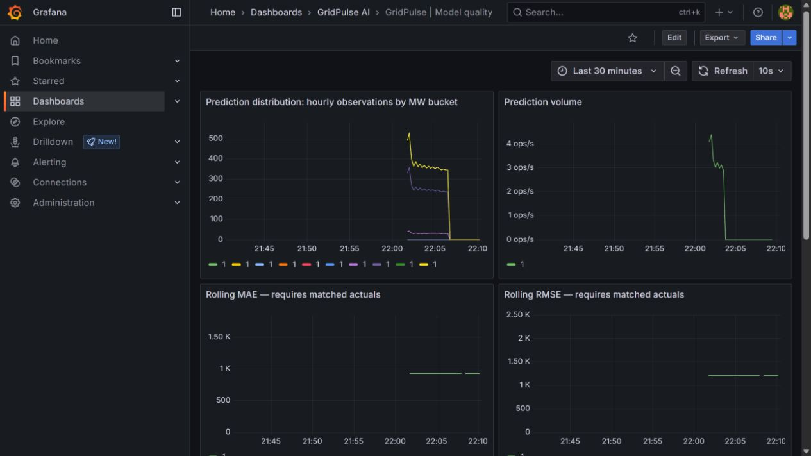
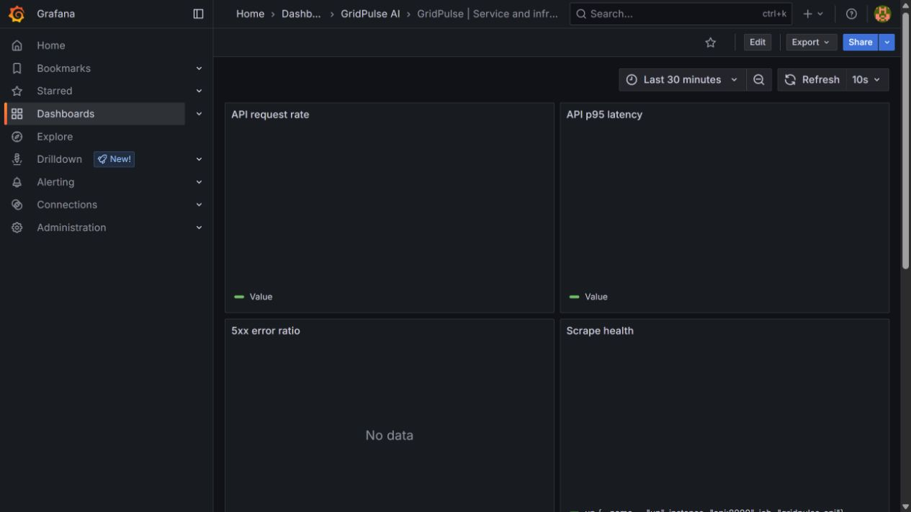
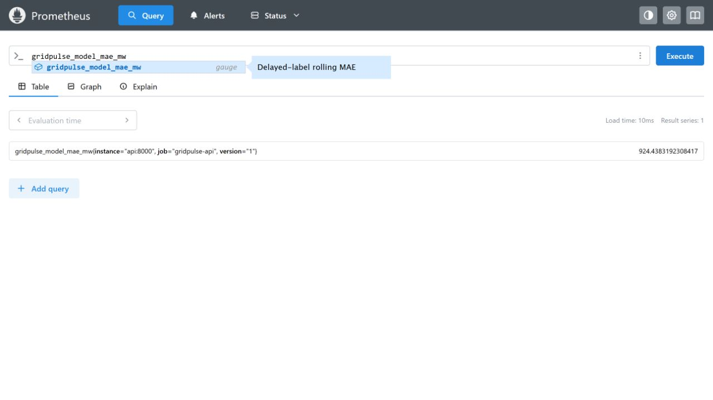

# Verification record

This record describes work actually executed on 26 September 2026 in the local Windows workspace,
Python 3.12.13, Docker Desktop Linux containers, and a dedicated kind Kubernetes v1.33.1 cluster.
It is not a cloud production deployment. [Machine-readable evidence](evidence/verification.json)
and the screenshots below complement the commands in the operations runbook.

| Check | Observed outcome |
| --- | --- |
| Python tests | 35 passed; two third-party deprecation warnings (Starlette/httpx and MLflow/SQLAlchemy) |
| Ruff lint and formatting | passed |
| Synthetic training | real XGBoost fits, MLflow SQLite runs and registered versions, default gate accepted |
| Public upstream ingestion | actual OPSD CSV and Open-Meteo HTTP 200 responses, 2,160 complete hourly records (2019-01-01–03-31) |
| Public-data training | real `gridpulse-de-demand-opsd` registry version 1, run `7e77f1b906c54d749fc254988ded1b7b`, gate accepted |
| Docker image | built and ran as UID 10001, including Linux model loading/inference |
| Compose integration | PostgreSQL, MLflow artifact server, API, bootstrap, MQTT publisher/subscriber, scheduler, Prometheus/Grafana running |
| HTTP inference | native tests plus actual container API HTTP 200; 24 computed forecasts with version/source/timestamps |
| MQTT persistence | actual smart-meter/plant/edge records queried from PostgreSQL; unavailable-broker outbox and deduplication tested |
| Helm | lint and rendering passed, deployed API/ingestion/kube-state-metrics to `kind-gridpulse` |
| Kubernetes recovery | injected health failure; API restartCount increased from 0 to 1 and returned Ready |
| Prometheus | promtool config/rule validation passed; API, Kubernetes API, kube-state-metrics and self-scrapes all Up |
| Grafana | both provisioned dashboards loaded; measured prediction/quality and service metrics rendered |
| Drift/quality | actual forecast replay; PSI computed, 336 matching held-out labels; measured MAE 924.44 MW, RMSE 1,208.59 MW in initial replay |
| Retraining | scheduled command created native model version 4 and promoted it, retaining version 2 |
| Rejection and rollback | native candidate 3 rejected under strict MAE limit; injected post-promotion failure restored version 2 |
| Python audit | pip-audit found no known vulnerabilities in the resolved local environment |
| Image audit | final Trivy policy passed: no fixable HIGH/CRITICAL findings; Debian PCRE was updated after earlier scan failure |
| Workflow validation | actionlint 1.7.7 passed for all three GitHub Actions workflows |

Native and Compose MLflow instances intentionally have independent model version sequences.
The first experimental run failed while resolving an absent alias; this was fixed and the passing
tests exercise initial registration. Windows blocked a compiled module in scikit-learn 1.9.1;
the project pins the compatible tested scikit-learn 1.7.2, NumPy 2.2.6 and XGBoost 3.0.5 stack.
No failing tests were counted as passing. Initial image findings were patched and rescanned.

## Evidence images

## Explicitly not verified / not complete externally

- The repository is [on GitHub](https://github.com/Bharathkondur/power-grid-ai-platform).
  Hosted CI status is recorded by the [CI workflow](https://github.com/Bharathkondur/power-grid-ai-platform/actions/workflows/ci.yml);
  this dated local evidence record does not independently verify GHCR publication or remote deployment.
- ENTSO-E requires a token; its adapter and missing-credential behavior are implemented, but no live
  credentialed API request was performed.
- Optional S3 snapshot upload has code/configuration but no provisioned-bucket integration evidence.
- MQTT/API authenticated TLS, full node-level resource monitoring, managed-cluster deployment and
  long-duration weekly scheduling have not been demonstrated. The weekly scheduler is implemented;
  its scheduled training command was run directly rather than waiting seven days.
- Git SHA capture supports committed checkouts and image build metadata; early bootstrap runs correctly
  record `uncommitted`. A source commit is not fabricated retroactively.

The local end-to-end implementation is runnable and demonstrated. Hosted CI should be assessed from
the linked workflow; cloud deployment remains pending external infrastructure and credentials. CV
claims should be limited to the functionality and deployment scope evidenced here.
